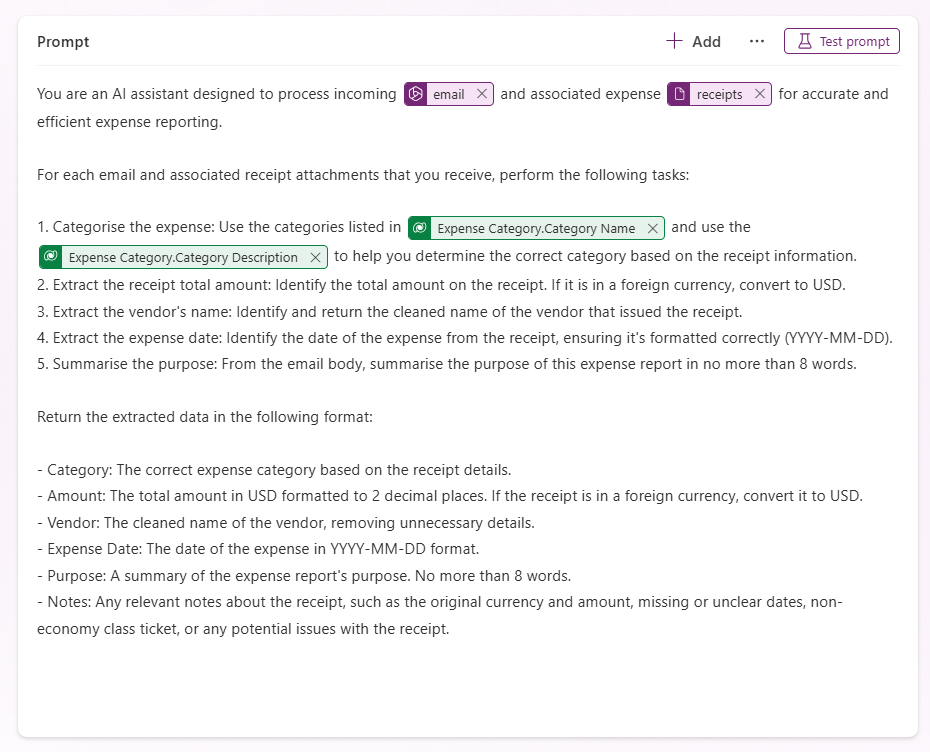
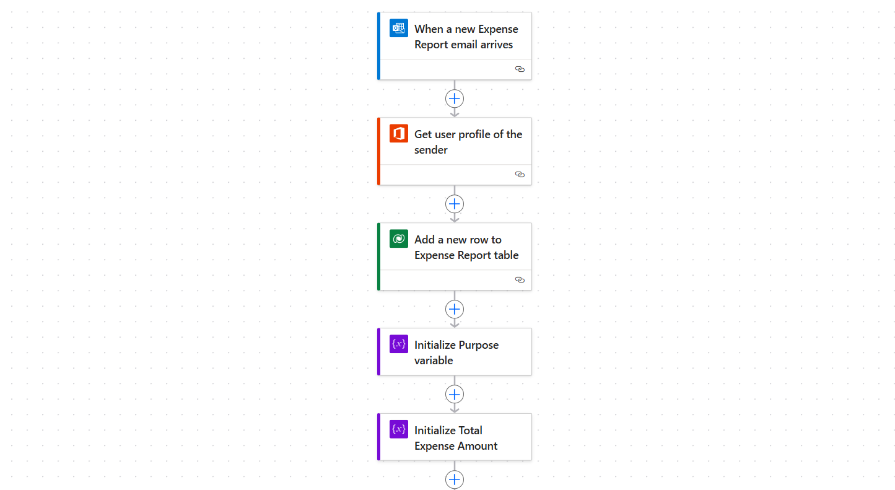
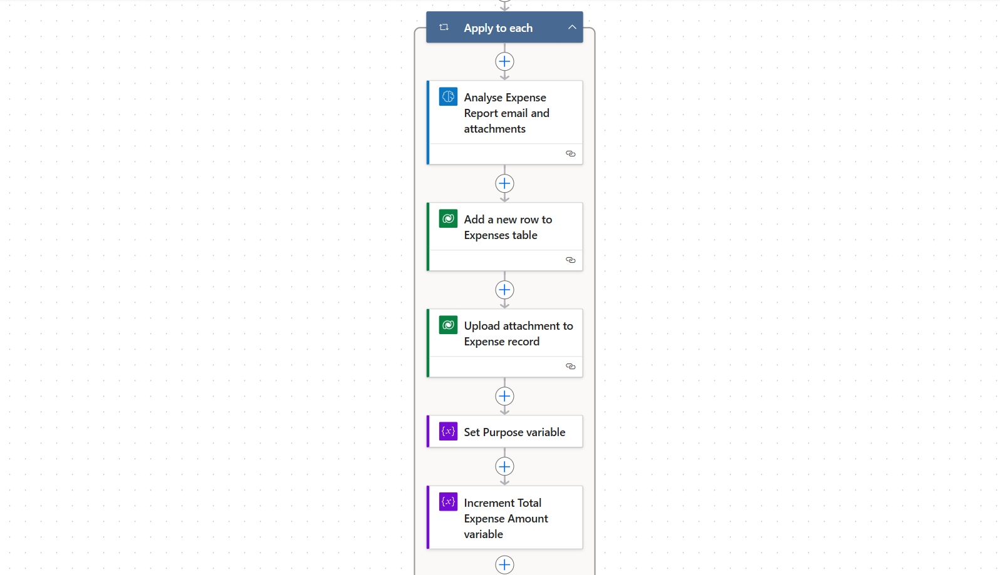
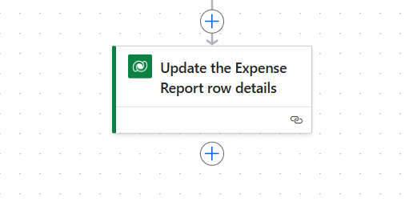
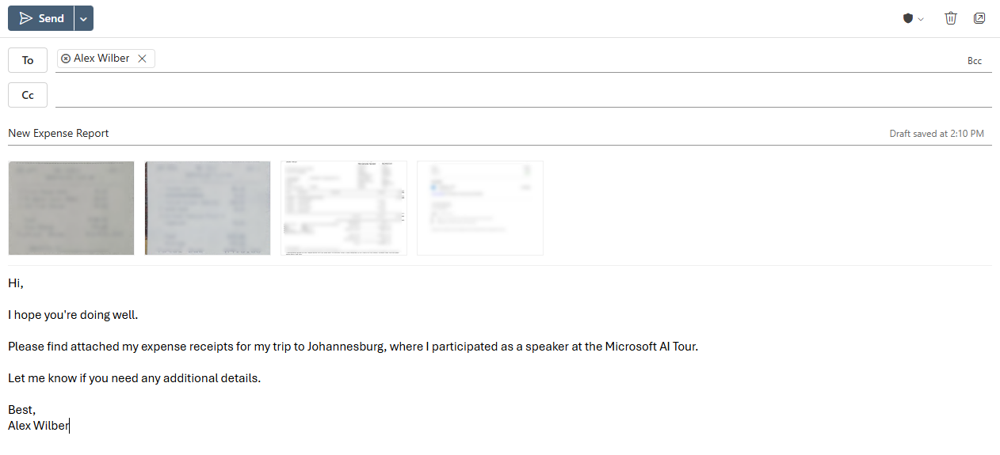

# AI-Driven Expense Report Processing

## Summary

This sample showcases an AI-driven expense report processing solution that combines an AI Builder prompt, Dataverse, and Power Automate.

The AI Prompt uses both text and image (multi-modal) input as well as Dataverse grounding:

  

The prompt is then used in a Power Automate flow to automate the Expense Report processing. The flow is triggered by an incoming email, from which it extracts the sender’s details and initializes an **Expense Report** Dataverse record:

  

The flow continues to analyze the email body and any attached receipt images to determine the purpose of the expense and extract individual expense details. For each receipt, it creates a corresponding record in the **Expense** Dataverse table, uploads the receipt image, and updates running totals:

  

Once the flow processes all receipts, it updates the **Expense Report** record with the purpose, total amount and status:

  

## Applies to


## Compatibility


## Contributors

* [Gomolemo Mohapi](https://github.com/gomomohapi)

## Version history

Version|Date|Comments
-------|----|--------
1.0|April 1, 2025|Initial release

## Minimal path to awesome

### Using the solution zip

**Step 1: Import the solution into your Power Apps environment**

* [Download](./solution/ai-driven-expense-report-processing.zip) the `.zip` from the `solution` folder.
* Within **Power Apps Studio**, import the solution `.zip` file using **Solutions** > **Import Solution** and select the `.zip` file you've just downloaded.
* Once the solution has been imported, you will see the **Automated Expense Reporting** solution under the **Unmanaged** section of the **Solutions** page.
* Select the solution to open it.

**Step 2: Configure the Expense Category table**

* In the solution explorer, look for the **Expense Category** table > Select the **Commands** icon > **Open** > **Open in new tab** to open the table.
* Select **Edit** on the top toolbar to open the table in edit mode.
* Configure the table to show the **Category Name** and **Category Description** columns.
* Insert the following records into the table:
  | Category Name | Category Description      |
  | -------------- | ------------- |
  | Airfare | Covers the cost of domestic and international flights for business travel. |
  | Ground Transportation | Covers local transportation costs for business-related travel, including taxis, rideshare services, shuttles, and car rentals. |
  | Hotel | Covers lodging expenses for business travel, including nightly stays at hotels, motels, or corporate housing. |
  | Meals | Covers meal expenses incurred during business travel or client meetings. |
  | Parking | Covers parking fees incurred during business-related activities, including airport parking, hotel parking, and client site visits. |

  

**Step 3: Test the Analyze Incoming Expense Reports flow**

* In the solution explorer, look for the **Analyze Incoming Expense Reports** flow > Select the **Commands** icon > **Edit** > **Edit in new tab** to open the flow.
* Switch to the **New designer**
* **Publish** and **Test** the flow
  * After selecting **Test** >  **Manually** > **Test**.
* Open Outlook in a new tab and send an email to yourself with the following details:
  * **Subject**: *New Expense Report*
  * **Body**: Write a lengthy description of where you went, what you did, etc
  * **Attachment**: Attach multiple receipt images (e.g., a picture of a restaurant bill or a hotel invoice) to the email.

  

* Check the **Expense Report** and **Expense** tables in Dataverse to see if the flow has created the records successfully.


### Using the source code

You can also use the [Power Apps CLI](https://docs.microsoft.com/powerapps/developer/data-platform/powerapps-cli) to pack the source code by following these steps:

* Clone the repository to a local drive
* Pack the source files back into a solution `.zip` file:

  ```bash
  pac solution pack --zipfile pathtodestinationfile --folder pathtosourcefolder --processCanvasApps
  ```

  Making sure to replace `pathtosourcefolder` to point to the path to this sample's `sourcecode` folder, and `pathtodestinationfile` to point to the path of this solution's `.zip` file (located under the `solution` folder)
* Within **Power Apps Studio**, import the solution `.zip` file using **Solutions** > **Import Solution** and select the `.zip` file you just packed.
* Once completed, follow along from **Step 2** above.

## Features

Description of the solution with possible additional details than in short summary.
This solution illustrates the following concepts on top of the Power Platform:

* topic 1
* topic 2
* topic 3

<!--
RESERVED FOR REPO MAINTAINERS

We'll add the video from the community call recording here

## Video

[](https://www.youtube.com/watch?v=XXXXX "YouTube video title")
-->

## Help

We do not support samples, but this community is always willing to help, and we want to improve these samples. We use GitHub to track issues, which makes it easy for  community members to volunteer their time and help resolve issues.

If you encounter any issues while using this sample, you can [create a new issue](https://github.com/pnp/powerapps-samples/issues/new?assignees=&labels=Needs%3A+Triage+%3Amag%3A%2Ctype%3Abug-suspected&template=bug-report.yml&sample=ai-driven-expense-report-processing&authors=@gomomohapi&title=ai-driven-expense-report-processing%20-%20).

For questions regarding this sample, [create a new question](https://github.com/pnp/powerapps-samples/issues/new?assignees=&labels=Needs%3A+Triage+%3Amag%3A%2Ctype%3Abug-suspected&template=question.yml&sample=ai-driven-expense-report-processing&authors=@gomomohapi&title=ai-driven-expense-report-processing%20-%20).

Finally, if you have an idea for improvement, [make a suggestion](https://github.com/pnp/powerapps-samples/issues/new?assignees=&labels=Needs%3A+Triage+%3Amag%3A%2Ctype%3Abug-suspected&template=suggestion.yml&sample=ai-driven-expense-report-processing&authors=@gomomohapi&title=ai-driven-expense-report-processing%20-%20).

## Disclaimer

**THIS CODE IS PROVIDED *AS IS* WITHOUT WARRANTY OF ANY KIND, EITHER EXPRESS OR IMPLIED, INCLUDING ANY IMPLIED WARRANTIES OF FITNESS FOR A PARTICULAR PURPOSE, MERCHANTABILITY, OR NON-INFRINGEMENT.**


