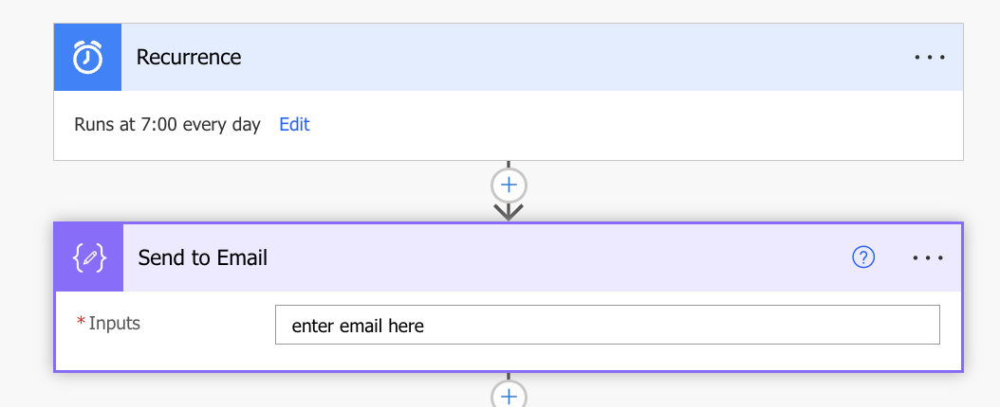
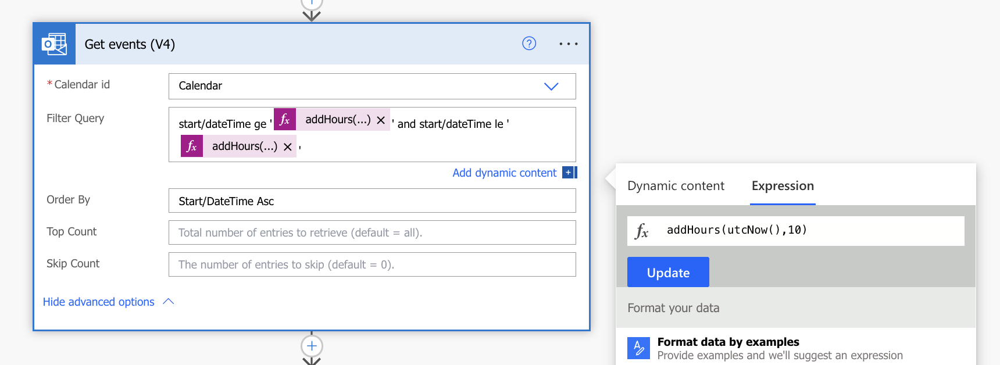

# AI Daily Time Management Plan

## Summary

A daily flow that utilizes a custom Prompt in AI Builder to take your Outlook calendar events and Microsoft ToDo (Business) tasks for the day and formulates a plan for how to allot your time for the day.

## Applies to

* [Microsoft Power Automate](https://docs.microsoft.com/en-us/power-automate/getting-started)
* [Azure Logic Apps](https://docs.microsoft.com/en-us/azure/logic-apps/logic-apps-overview)
* [AI Builder Custom Prompts](https://learn.microsoft.com/en-us/ai-builder/create-a-custom-prompt)

## Compatibility

## Features
This solution consists of a Scheduled Cloud Flow and a Custom AI Builder Prompt from the [Power Platform Prompts Library](https://aka.ms/prompts/time-management).

It demonstrates how to:
 * Call an AI Prompt in a Flow
 * Pass dynamic inputs into the prompt
 * Get a customized AI generated plan in HTML format so that it's email ready.

The only configuration required is to fill in the Compose action with the email you want to send the daily time management plan to as seen below:

You will also need to customize the recurrence to your needs.  It is set to 7am daily.  If you change the time you'll also need to update the Filter in the Get Events action so accomodate for the time change as seen below:

## Authors

Solution|Author(s)
--------|---------
ai-time-management-flow | [April Dunnam](https://github.com/aprildunnam), Microsoft

## Version history

Version|Date|Comments
-------|----|--------
1.0|March 4, 2024|Initial release

## Minimal Path to Awesome

* [Download](solution/AITimeManagementFlow.zip) the `.zip` from the `solution` folder
* [Import](https://flow.microsoft.com/en-us/blog/import-export-bap-packages/) the `.zip` file using **My Flows** > **Import** > **Upload** within Microsoft Flow.

## Disclaimer

**THIS CODE IS PROVIDED *AS IS* WITHOUT WARRANTY OF ANY KIND, EITHER EXPRESS OR IMPLIED, INCLUDING ANY IMPLIED WARRANTIES OF FITNESS FOR A PARTICULAR PURPOSE, MERCHANTABILITY, OR NON-INFRINGEMENT.**

## Help

We do not support samples, but we this community is always willing to help, and we want to improve these samples. We use GitHub to track issues, which makes it easy for  community members to volunteer their time and help resolve issues.

If you encounter any issues while using this sample, [create a new issue](https://github.com/pnp/powerautomate-samples/issues/new?assignees=&labels=Needs%3A+Triage+%3Amag%3A%2Ctype%3Abug-suspected&template=bug-report.yml&sample=always-reply-to-request&authors=@remyblok&title=always-reply-to-request%20-%20).

For questions regarding this sample, [create a new question](https://github.com/pnp/powerautomate-samples/issues/new?assignees=&labels=Needs%3A+Triage+%3Amag%3A%2Ctype%3Abug-suspected&template=question.yml&sample=always-reply-to-request&authors=@remyblok&title=always-reply-to-request%20-%20).

Finally, if you have an idea for improvement, [make a suggestion](https://github.com/pnp/powerautomate-samples/issues/new?assignees=&labels=Needs%3A+Triage+%3Amag%3A%2Ctype%3Abug-suspected&template=suggestion.yml&sample=always-reply-to-request&authors=@remyblok&title=always-reply-to-request%20-%20).

## For more information

- [Create your first flow](https://docs.microsoft.com/en-us/power-automate/getting-started#create-your-first-flow)
- [Microsoft Power Automate documentation](https://docs.microsoft.com/en-us/power-automate/)

