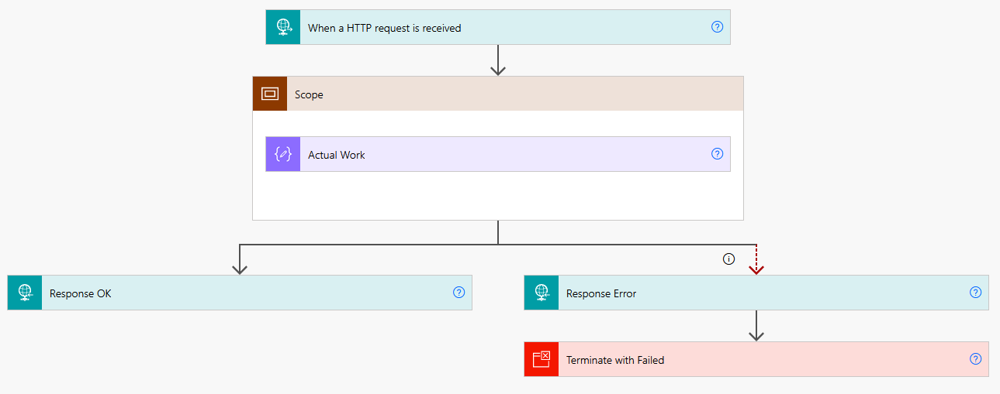
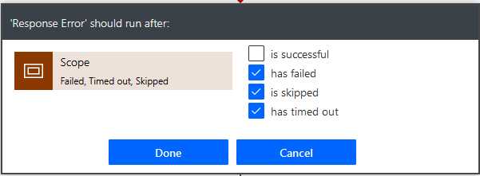

# Pattern: Always respond to a request

## Summary

A pattern for making sure that the Flow always provides a responds to a request.

## Applies to

* [Microsoft Power Automate](https://docs.microsoft.com/en-us/power-automate/getting-started)
* [Azure Logic Apps](https://docs.microsoft.com/en-us/azure/logic-apps/logic-apps-overview)

## Compatibility

## Authors

Solution|Author(s)
--------|---------
always-reply-to-request | [Remy Blok](https://github.com/remyblok), Prodware

## Version history

Version|Date|Comments
-------|----|--------
1.0|May 02, 2021|Initial release

## Features

Power Automate has the ability to be called by 3th parties using HTTP requests or via the API. In these cases the caller will wait for the Flow to respond. If the Flow does not respond you get an HTTP 500 error from the Flow runtime with the message `The server did not receive a response from an upstream server.`

This pattern makes sure that you always respond to the caller. Also in case you Flow fails you can then send back relevant information on why the flow has failed. In this sample it returns the error that occurred in the Scope. But responses to the end user with a descriptive message is always preferred. 

Requests and responses are used in multiple areas:
* Per this sample, using `HTTP Request`-trigger and `HTTP Response`-action to create a Flow that is callable via HTTP by any party that can handle HTTP
* When using the Flow as a [child Flow](https://docs.microsoft.com/en-us/power-automate/create-child-flows). The trigger will be `Manual trigger`, the response will be a `Respond to PowerApp` or a `HTTP Response` action
* When starting a [Flow from a Canvas Power App](https://docs.microsoft.com/en-us/powerapps/maker/canvas-apps/using-logic-flows). In this case the trigger is `PowerApps`, the response will be a `Respond to PowerApp` or a `HTTP Response` action

In this sample we use a Scope to contain all the logic of the Flow. By setting the 'Configure run after' on the error `Response`-action to run only on error we can differentiate the error between sending a OK or an Error message. By default any action's 'Configure run after' is set to 'is successful'.

Note: you can setup the responses to use the [Asynchronous pattern](https://docs.microsoft.com/en-us/azure/connectors/connectors-native-http#asynchronous-request-response-behavior). This is useful for long running flows. In this case the error will also be correctly returned as result for your long running flow. This can also be used when the Flow is used as a child flow using the `Respond to PowerApps`-action. It does *not* work when the Flow is called from a Power App.

Note 2: The reason that the OK response is outside the Scope in stead of having one of more responses inside the Scope, is to make sure the schema of the result is the same. Since there is only one place where the result (and it's schema) is defined, changes to the result (schema) are easily realized. Since you are basically setting up an API having a single consistent schema for all responses is recommended.

## Minimal Path to Awesome

* [Download](solution/always-reply-to-request.zip) the `.zip` from the `solution` folder
* [Import](https://flow.microsoft.com/en-us/blog/import-export-bap-packages/) the `.zip` file using **My Flows** > **Import** > **Upload** within Microsoft Flow.

## Disclaimer

**THIS CODE IS PROVIDED *AS IS* WITHOUT WARRANTY OF ANY KIND, EITHER EXPRESS OR IMPLIED, INCLUDING ANY IMPLIED WARRANTIES OF FITNESS FOR A PARTICULAR PURPOSE, MERCHANTABILITY, OR NON-INFRINGEMENT.**

## Help

We do not support samples, but we this community is always willing to help, and we want to improve these samples. We use GitHub to track issues, which makes it easy for  community members to volunteer their time and help resolve issues.

If you encounter any issues while using this sample, [create a new issue](https://github.com/pnp/powerautomate-samples/issues/new?assignees=&labels=Needs%3A+Triage+%3Amag%3A%2Ctype%3Abug-suspected&template=bug-report.yml&sample=always-reply-to-request&authors=@remyblok&title=always-reply-to-request%20-%20).

For questions regarding this sample, [create a new question](https://github.com/pnp/powerautomate-samples/issues/new?assignees=&labels=Needs%3A+Triage+%3Amag%3A%2Ctype%3Abug-suspected&template=question.yml&sample=always-reply-to-request&authors=@remyblok&title=always-reply-to-request%20-%20).

Finally, if you have an idea for improvement, [make a suggestion](https://github.com/pnp/powerautomate-samples/issues/new?assignees=&labels=Needs%3A+Triage+%3Amag%3A%2Ctype%3Abug-suspected&template=suggestion.yml&sample=always-reply-to-request&authors=@remyblok&title=always-reply-to-request%20-%20).

## For more information

- [Create your first flow](https://docs.microsoft.com/en-us/power-automate/getting-started#create-your-first-flow)
- [Microsoft Power Automate documentation](https://docs.microsoft.com/en-us/power-automate/)

