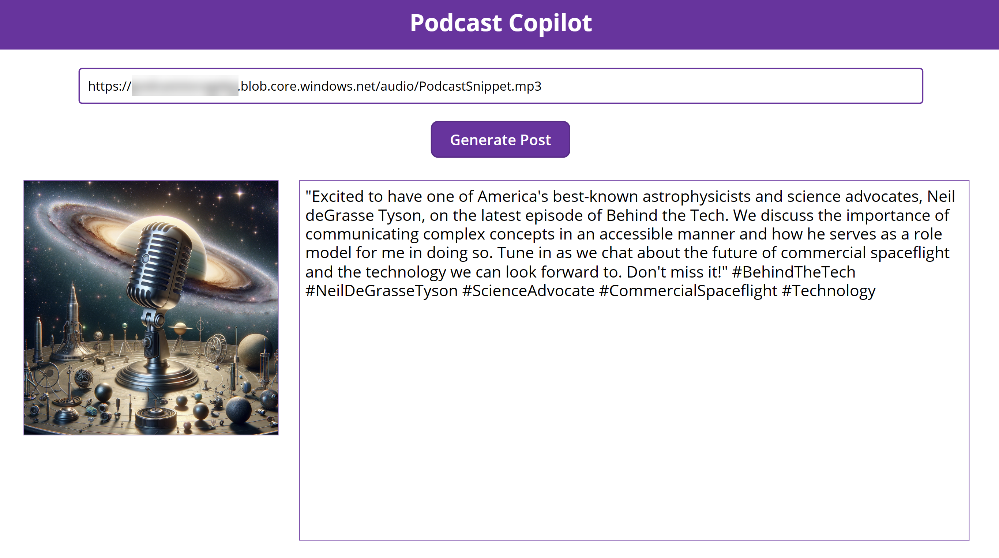

# Podcast Copilot

## Summary

This sample allows the user to enter a link to a podcast episode and then it generates a promotional social media image and blurb for the episode with AI. The user can then download the image and blurb to share on social media.

Sample consists of a Power Apps canvas app, a Power Automate cloud flow, and a Copilot Studio copilot.

### It works in two ways

**Power Apps**

User enters a link to a podcast episode and then a custom connector is called to generate the promotional image and blurb for the episode.

**Copilot Studio and Power Automate**

User asks the copilot to generate a promotional social media post and then proceeds to provide the link to the podcast episode.

The copilot then calls the Power Automate cloud flow which in turn invokes the custom connector to generate the promotional image and blurb for the episode.

## Applies to

## Compatibility

## Contributors

Solution|Author(s)
--------|---------
podcast-copilot | [Gomolemo Mohapi](https://github.com/gomomohapi), Microsoft

## Version history

Version|Date|Comments
-------|----|--------
1.0|April 12, 2024|Initial release

## Prerequisites

* Make sure you have access to Power Apps, Power Automate and Copilot Studio.
* Create an [Azure account](https://azure.microsoft.com/free/) and select **Start Free** and then fill in profile details to complete the sign up process.

    

* To use all the Azure OpenAI Service AI Models, you'll need to request access by completing [this form](https://aka.ms/oai/access). For the question; **Which Azure OpenAI service features are you requesting access for?**, select GPT-3.5, GPT-3.5 Turbo, GPT-4, GPT-4 Turbo, and/or Embeddings Models, DALL-E 2 and/or DALL-E 3 models, and OpenAI Whisper model.

    

* To use this sample, you will create your own Custom Connector using the [Visual Studio Connected Service for the Power Platform](https://learn.microsoft.com/en-us/power-platform/developer/visual-studio-connected-service). For this; download and install [Visual Studio (Community Edition)](https://visualstudio.microsoft.com/vs/features/net-development/)

    

    This installer comes pre-packaged with all the components you need for .NET development.
* Finally, clone the [PodcastAppAPI Sample Project](https://github.com/gomomohapi/PodcastAppAPI) to your local machine and open with Visual Studio.
    * Once you follow the link to the project, select **Code** and then copy the git URL.

         

    * Open Visual Studio and select **Clone a repository**.

        

    * Then paste in the link you copied from GitHub and select **Clone**.

    * The project will then open in Visual Studio.

## Minimal path to awesome

### Using the solution zip file

* [Download](solution/PodcastCopilotSolution_1_0_0_2.zip) the `.zip` from the `solution` folder
* Within **Power Apps Studio**, import the solution `.zip` file using **Solutions** > **Import Solution** and select the `.zip` file you just downloaded
* 