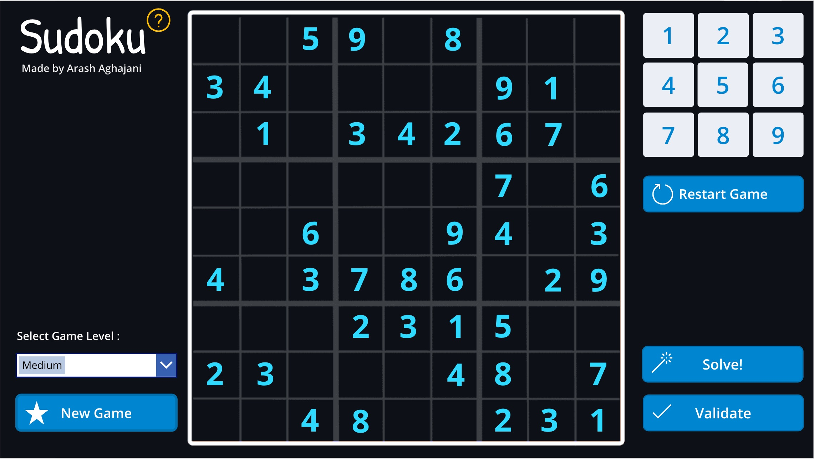

# Sudoku Power App Game

## Summary

Sudoku App is a Japanese puzzle game made for Power Apps.

  

## Features

In this app, various functions of Power Apps are used, and the methods of creating a puzzle game are presented. The method of calling and validating data using an Independent Publisher Connector is also included in this app.

## Applies to

* [Microsoft Power Apps](https://docs.microsoft.com/powerapps/)

## Compatibility


## Authors

Solution|Author(s)
--------|---------
Sudoku  | [Arash Aghajani](https://github.com/ArashAghajani/) ([@AghajaniArash](https://www.twitter.com/aghajaniarash) )

## Version history

Version|Date|Comments
-------|----|--------
1.0|Jan 20, 2024|Initial release

## Prerequisites

You must have a Power Apps Premium license for the environment in which you want to import and run the Sudoku App. The app utilizes Shadify's free connector service to obtain sudoku grid data and perform result validation. Therefore, to use the app, you need to have a Premium Power Apps license.


### Using the sample

No configuration is needed to use this sample. The only connector required is the Shadify connector, which is used to retrieve Sudoku grid data and validate the results.


## Minimal Path to Awesome

1. [Download](./solution/Sudoku_1_0_0_2.zip) the solution `.zip` from the `solution` folder.
2. Within **https://make.powerapps.com**, import the `.zip` file via **Solutions** > **Import solution** > **Browse** and select the `.zip` file you just downloaded.
3. Follow the on-screen instructions to deploy the app.

## Using the Source Code

You can also use the [Power Apps CLI](https://aka.ms/pac/docs) to pack the source code by following these steps:

1. Clone the repository to a local drive.
2. Pack the source files back into `.zip` file:
   ```bash
   pac solution pack --folder pathtosourcefolder --zipfile pathtosolution --processCanvasApps
   ```


## Help

We do not support samples, but this community is always willing to help, and we want to improve these samples. We use GitHub to track issues, which makes it easy for  community members to volunteer their time and help resolve issues.

If you encounter any issues while using this sample, you can [create a new issue](https://github.com/pnp/powerapps-samples/issues/new?assignees=&labels=Needs%3A+Triage+%3Amag%3A%2Ctype%3Abug-suspected&template=bug-report.yml&sample=upload-to-sharepoint&authors=@shaheerahmadch&title=upload-to-sharepoint%20-%20).

For questions regarding this sample, [create a new question](https://github.com/pnp/powerapps-samples/issues/new?assignees=&labels=Needs%3A+Triage+%3Amag%3A%2Ctype%3Abug-suspected&template=question.yml&sample=upload-to-sharepoint&authors=@shaheerahmadch&title=upload-to-sharepoint%20-%20).

Finally, if you have an idea for improvement, [make a suggestion](https://github.com/pnp/powerapps-samples/issues/new?assignees=&labels=Needs%3A+Triage+%3Amag%3A%2Ctype%3Abug-suspected&template=suggestion.yml&sample=upload-to-sharepoint&authors=@shaheerahmadch&title=upload-to-sharepoint%20-%20).

## Disclaimer

**THIS CODE IS PROVIDED *AS IS* WITHOUT WARRANTY OF ANY KIND, EITHER EXPRESS OR IMPLIED, INCLUDING ANY IMPLIED WARRANTIES OF FITNESS FOR A PARTICULAR PURPOSE, MERCHANTABILITY, OR NON-INFRINGEMENT.**